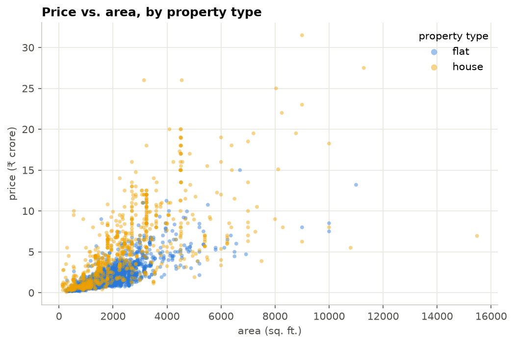

# Gurgaon Real Estate — Exploratory Data Analysis

A reproducible, end-to-end exploratory data analysis of **~3,800 residential property listings** (flats and independent houses) in Gurgaon, India — from raw scraped feed to cleaned dataset and market insights.

**▶ [Live interactive dashboard](https://safdar-hussain1.github.io/Gurgaon-RealEstate-EDA/)** — a sector-by-sector price atlas with a flat/house segment toggle.



## Highlights

- **Documented cleaning pipeline** (`src/cleaning.py`): duplicate removal, categorical labelling, and percentile-based trimming of unit-error records (e.g. an "875,000 sq. ft. flat" and ₹600,000/sq.ft. entries), with a per-step log of rows affected.
- **Reusable code, not just a notebook** — cleaning rules and plot styling live in an importable `src/` package; the notebook stays focused on narrative and analysis.
- **Market findings**: houses list at ~3× the median price of flats; sector medians span roughly 5×; 3 BHK dominates supply; bathrooms and bedrooms are nearly interchangeable signals (r ≈ 0.9); and the apparent "old property premium" in ₹/sq.ft. turns out to be a Simpson's paradox driven by property mix.

## Repository structure

```
├── data/
│   ├── raw/gurgaon_properties.csv                  # original listings feed (3,803 rows)
│   ├── processed/gurgaon_properties_cleaned.csv    # generated by the pipeline (3,600 rows)
│   └── DATA_DICTIONARY.md                          # column reference
├── notebooks/
│   └── gurgaon_real_estate_eda.ipynb               # the full analysis, executed top-to-bottom
├── src/
│   ├── cleaning.py                                 # cleaning pipeline (pure, testable functions)
│   └── config.py                                   # paths, palette, matplotlib theme
├── scripts/
│   └── make_clean_dataset.py                       # CLI: raw CSV -> cleaned CSV
└── reports/figures/                                # all charts exported as PNG
```

## Quickstart

Requires Python 3.10+.

```bash
git clone https://github.com/safdar-hussain1/Gurgaon-RealEstate-EDA.git
cd Gurgaon-RealEstate-EDA

python -m venv .venv && source .venv/bin/activate   # Windows: .venv\Scripts\activate
pip install -r requirements.txt

# Rebuild the cleaned dataset from raw
python scripts/make_clean_dataset.py

# Explore the analysis
jupyter lab notebooks/gurgaon_real_estate_eda.ipynb
```

The notebook runs top-to-bottom with no manual steps and regenerates every figure in `reports/figures/`.

## Data

`data/raw/gurgaon_properties.csv` — 3,803 listings × 23 columns scraped from a property portal. Prices are in **₹ crore** (1 crore = 10 million), `price_per_sqft` in ₹, and areas in sq. ft. See [`data/DATA_DICTIONARY.md`](data/DATA_DICTIONARY.md) for every column.

Known quirks handled by the pipeline:

| Issue | Extent | Treatment |
|---|---|---|
| Exact duplicate listings | 126 rows | dropped |
| Missing price/area | 17 rows | dropped (unusable for price analysis) |
| Unit-error outliers | ~60 rows | trimmed outside 0.5th–99.5th percentile of `price_per_sqft` and `area` |
| Missing area breakdowns | ~49% of rows | kept as optional attributes (portal-side optional fields) |
| `agePossession = "Undefined"` | 333 rows | treated as missing |

## Key findings

1. **Two markets, one city** — independent houses have ~3× the median price of flats and higher ₹/sq.ft.; within each segment, area is the strongest price driver.
2. **Location is a step function** — median prices across sectors (≥30 listings) span ~5×, topped by the golden-corridor sectors.
3. **3 BHK is the centre of gravity** of supply; median price roughly doubles per additional bedroom up to 5 BHK.
4. **Bathrooms ≈ bedrooms** (r ≈ 0.91) — they carry nearly identical information about property size.
5. **A Simpson's paradox in property age** — in aggregate, *old* properties show the highest ₹/sq.ft., but only because 58% of old listings are houses (vs 22% overall) and houses carry ~2.5× the ₹/sq.ft. of flats. Within flats, under-construction stock is the priciest per sq.ft.

Full reasoning and charts are in the [notebook](notebooks/gurgaon_real_estate_eda.ipynb).

## Tech stack

Python · pandas · NumPy · Matplotlib · Jupyter

## License

[MIT](LICENSE)
